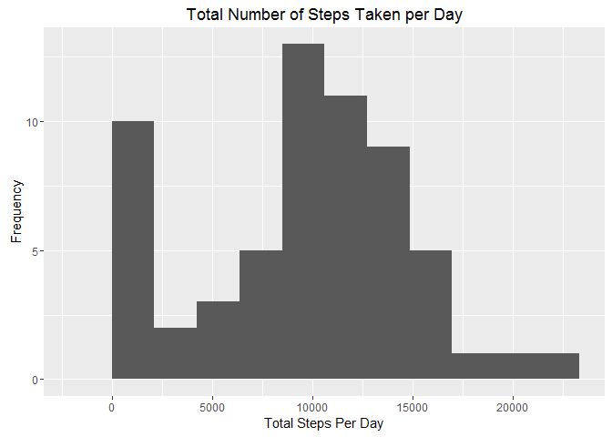
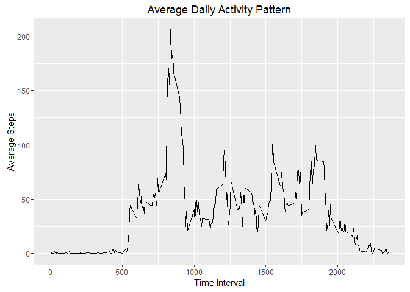
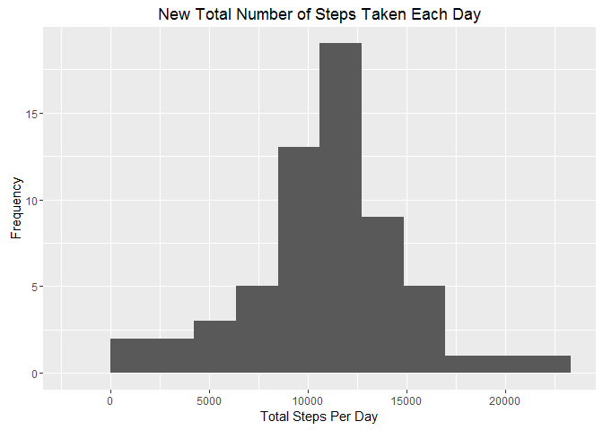
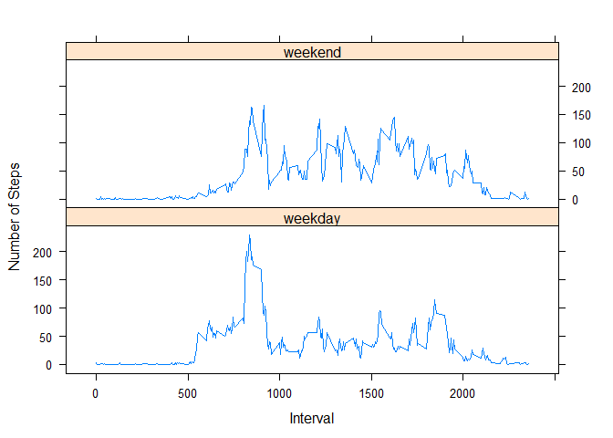

# Reproducible Research: Peer Assessment 1


## Loading and preprocessing the data


```r
#  Check if the csv file exists and unzip the original file
if(file.exists("activity.csv")==FALSE){
  unzip("activity.zip")
}
#  Read the csv file
rawData <- read.csv("activity.csv")
#  Process the raw data
data <- transform(rawData, date = as.Date(rawData$date, 
                  fomat ="%Y-%m-%d") )
```

## What is mean total number of steps taken per day?


```r
#  Load the ggplot2 package
library(ggplot2)
#  Calculate the the total numer of steps per day
steps <- tapply(data$steps, data$date, sum, na.rm = TRUE)
#  Make a histogram of the total number of steps taken each day
qplot(steps,xlab="Total Steps Per Day",ylab="Frequency", 
      main= "Total Number of Steps Taken per Day", binwidth = max(steps/10))
```

\

```r
#  Calculate the mean value
stepsMean <- round(mean(steps))
#  Calculate the mean value
stepsMed <- median(steps)
#  Report mean value
stepsMean
```

```
## [1] 9354
```

```r
#  Report median value
stepsMed
```

```
## [1] 10395
```
The mean total number of steps taken per day is **9354**.    
The median total number of steps taken per day is **10395**.  

## What is the average daily activity pattern?


```r
#  Calculate the average number of steps
avgSteps <- aggregate(list(steps=data$steps), list(interval = data$interval), 
                      mean, na.rm = TRUE)
#  Make a time series plot
ggplot(avgSteps, aes(interval, steps)) + geom_line() + xlab("Time Interval") +
      ylab("Average Steps") + ggtitle("Average Daily Activity Pattern") 
```

\

```r
#  Find the maximum number of steps
max <- avgSteps[which(avgSteps$steps == max(avgSteps$steps)), 1]
#Report max value
max
```

```
## [1] 835
```
The 5-minute interval with the maximum number of average steps taken across all days in dataset is **835**.

## Imputing missing values

```r
#  count the NAs
countNAs <- sum(is.na(data$steps))
# Report the total missing value
countNAs
```

```
## [1] 2304
```
Total number of missing values in dataset is **2304**. 

```r
#  Create a new dataset
dataNew <- data
#  Devise mean value per interval for filling in all of the missing values in the dataset
positionNA <- which(is.na(dataNew$steps))
dataNew$steps[positionNA] <- avgSteps[match(dataNew$interval,avgSteps$interval)[positionNA],2]
#  Make a histogram of the total number of steps taken per day
totalSteps <- tapply(dataNew$steps,dataNew$date,sum)
qplot(totalSteps, binwidth = max(totalSteps/10), xlab = "Total Steps Per Day",
      ylab = "Frequency", main = "New Total Number of Steps Taken Each Day")
```

\

```r
#  Median and mean
totalMed <- format(median(totalSteps),scientific = FALSE)
totalMean <- format(mean(totalSteps),scientific = FALSE)
#  Report the median
totalMed
```

```
## [1] "10766.19"
```

```r
#  Report the mean
totalMean
```

```
## [1] "10766.19"
```
The mean total number of steps taken per day is **10766.19**, while the previews mean is **9354**.  
The median total number of steps taken per day is **10766.19**, while the previews median is **10395**.  
The two estimates produced the different value of mean and median. The reason mainly came from the imputted/filled missing values, which resulted in the larger values in the second estimate.   

## Are there differences in activity patterns between weekdays and weekends?

```r
#  Set the Languague as English(for non-English OS) 
Sys.setlocale("LC_TIME", "English")      
```

```
## [1] "English_United States.1252"
```

```r
#  Define weekdays
wkdy <- c("Monday", "Tuesday", "Wednesday", "Thursday", "Friday")
dataNew$WD = ifelse(weekdays(dataNew$date) %in% wkdy, "weekday", "weekend")
#  Aggregate the dataset
dataFinal <- aggregate(dataNew$steps,list(Interval = dataNew$interval, Weektype = dataNew$WD),mean)
#  Plot the digram
library(lattice)
xyplot(x ~ Interval | Weektype, dataFinal, layout=c(1,2), type = "l", ylab = "Number of Steps")
```

\
  
Difference between weekdays and weekends:   
1. the peaks of weedays and weekends apear at the similar period(around 9am), but the peak of weekdays is much higher.  
2. step activity of weekdays tends to be smoother compared to the weekend  
